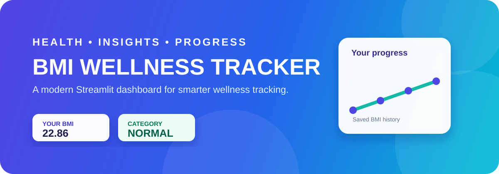
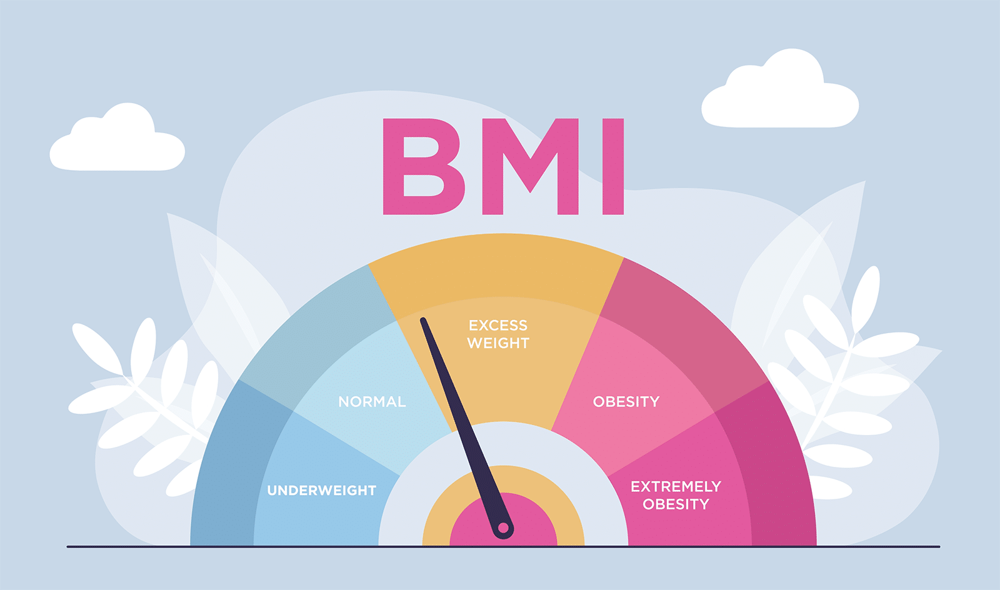

<p align="center">
  
</p>

<p align="center">
  
</p>

<p align="center">
  <b>A modern Streamlit BMI calculator with personal wellness insights, history and analytics.</b>
</p>

<p align="center">
  
  
  
</p>

## About the project

**BMI Wellness Tracker** is a professional Python project created for *Task 2 – BMI Calculator*. It calculates BMI, identifies the category and gives clear colour-based feedback. Users can safely store, search, edit, analyse and export their BMI history.

> BMI is a screening tool, not a medical diagnosis. For health concerns, consult a qualified healthcare professional.

## Highlights

| Core calculator | Advanced tracking |
| --- | --- |
| Metric and imperial input | Multiple-user SQLite history |
| Input validation | CSV backup and download |
| Underweight, Normal, Overweight and Obese categories | Search, category and gender filters |
| Colour feedback and wellness tip | Edit and delete individual records |
| Healthy weight-range helper | PDF report and visual analytics |

## Dashboard preview

The app has five easy sections:

```text
Dashboard  →  Calculator  →  History  →  Analytics  →  About
```

- **Dashboard** — overview, recent measurements and BMI category guide.
- **Calculator** — personalised BMI calculation with metric/imperial conversion.
- **History** — searchable records, filters, CSV/PDF export and record management.
- **Analytics** — BMI comparison, trends and category-distribution charts.
- **About** — project details and formula.

## Formula and categories

```text
BMI = weight (kg) / height² (m)
```

| BMI value | Category |
| --- | --- |
| Below 18.5 | Underweight |
| 18.5 – 24.9 | Normal |
| 25.0 – 29.9 | Overweight |
| 30.0 and above | Obese |

## Tech stack

- **Python** — application logic
- **Streamlit** — modern interactive web interface
- **SQLite** — local database storage
- **Pandas** — history tables and data processing
- **Matplotlib** — analytics graphs
- **ReportLab** — PDF report generation

## Installation

1. Open PowerShell inside the project folder.

2. Activate the virtual environment:

   ```powershell
   .\venv\Scripts\Activate.ps1
   ```

3. Install dependencies if needed:

   ```powershell
   python -m pip install -r requirements.txt
   ```

4. Start the Streamlit app:

   ```powershell
   python -m streamlit run app.py
   ```

5. Open the URL shown in the terminal, usually `http://localhost:8501`.

### If PowerShell blocks activation

Run the app directly with the project environment:

```powershell
.\venv\Scripts\python.exe -m streamlit run app.py
```

## Project structure

```text
Python-Task 2-BMICalculator/
├── app.py                 # Main Streamlit application
├── bmi.py                 # BMI calculation, validation and conversion helpers
├── database.py            # SQLite CRUD operations
├── csv_handler.py         # CSV backup and export helpers
├── graph.py               # Analytics charts
├── gauge.py               # Live colour-coded BMI meter
├── pdf_report.py          # PDF report generator
├── assets/                # README banner and visual assets
├── csv/history.csv        # Local CSV backup
└── database/bmi.db        # Local SQLite database
```

## Data and privacy

All records are stored **locally** in `database/bmi.db`. A synchronised CSV backup is kept at `csv/history.csv`. No data is sent to an online server by this project.

## Developer

**Anjali Thakur**  
Built with care using Python and Streamlit.
