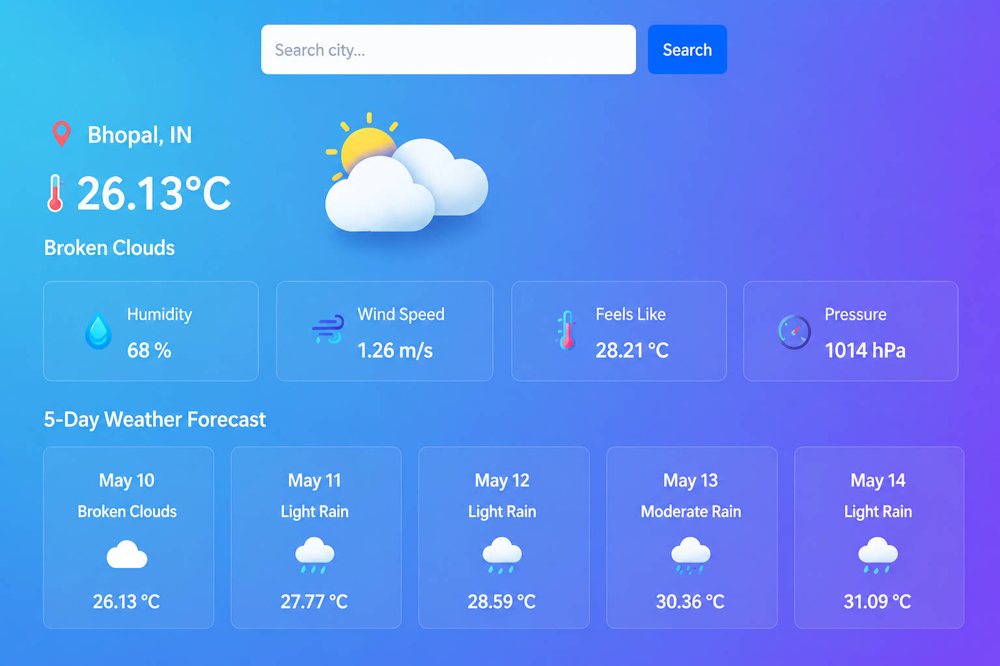

# 🌤️ Live Weather App

<p align="center">
  
</p>

<p align="center">


</p>

## 📖 About

A modern Weather Application built using **Python**, **Streamlit**, and **OpenWeatherMap API**.

It provides **real-time weather information** along with a **5-Day Weather Forecast** in a beautiful and responsive interface.

---

# ✨ Features

✅ Search Weather by City

✅ Current Temperature

✅ Celsius & Fahrenheit Support

✅ Weather Condition

✅ Weather Icon

✅ Humidity

✅ Wind Speed

✅ Atmospheric Pressure

✅ Feels Like Temperature

✅ Country Name

✅ Beautiful UI

✅ Responsive Layout

✅ Error Handling

✅ 5-Day Weather Forecast

✅ Fast API Response

---

# 📸 Project Preview


---

# 🛠️ Tech Stack

- Python
- Streamlit
- OpenWeatherMap API
- Requests

---

# 📂 Project Structure

```
Python-Task3-WeatherApp
│
├── app.py
├── requirements.txt
├── README.md
├── weather_app.png
└── .streamlit
    └── config.toml
```

---

# 🚀 Installation

Clone the repository

```bash
git clone https://github.com/anjali-thakur7691/OIBSIP.git
```

Go to project

```bash
cd Python-Task3-WeatherApp
```

Install packages

```bash
pip install -r requirements.txt
```

Run

```bash
streamlit run app.py
```

---

# 💻 Screenshots


---

# 👩‍💻 Author

**Anjali Thakur**

Python Developer

---

## ⭐ Support

If you like this project, don't forget to ⭐ the repository.

Made with ❤️ using Python & Streamlit