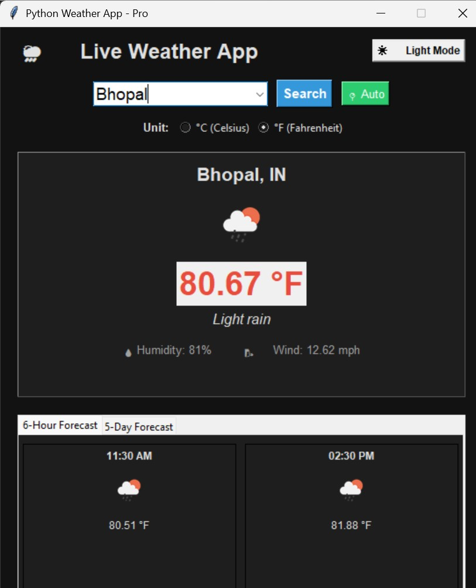

# 🌦️ Python Weather App (Pro Edition)

A feature-rich desktop Weather Application built using Python (`Tkinter`) and the OpenWeatherMap API. It provides real-time weather information, hourly/daily forecasts, search history, and a dynamic Dark/Light mode theme switcher.

---

## 📸 App Preview


---

## ✨ Features

- **🔍 City Search & Auto Location:** Search any city worldwide or auto-detect your location using IP.
- **🕒 Search History:** Automatically saves your last 5 searched cities for quick access using a dropdown combobox.
- **🌙 Dark / Light Mode:** Seamlessly switch between Light and Dark themes with a single click.
- **🌡️ Unit Toggle:** Switch dynamically between Celsius (°C) and Fahrenheit (°F).
- **📊 Detailed Forecasts:** 
  - 6-Hour upcoming forecast.
  - 5-Day daily weather forecast.
- **🎨 Live Weather Icons:** Real-time weather condition icons fetched directly from OpenWeatherMap.
- **🛡️ Error Handling:** Robust error management for invalid city names, empty inputs, and network failures.

---

## 🛠️ Prerequisites & Installation

Make sure you have **Python** installed on your system. Follow these steps to set up the project locally:

1. **Clone the repository:**
   ```bash
   git clone [https://github.com/AapkaUsername/Weather-App-Python.git](https://github.com/AapkaUsername/Weather-App-Python.git)
   cd Weather-App-Python